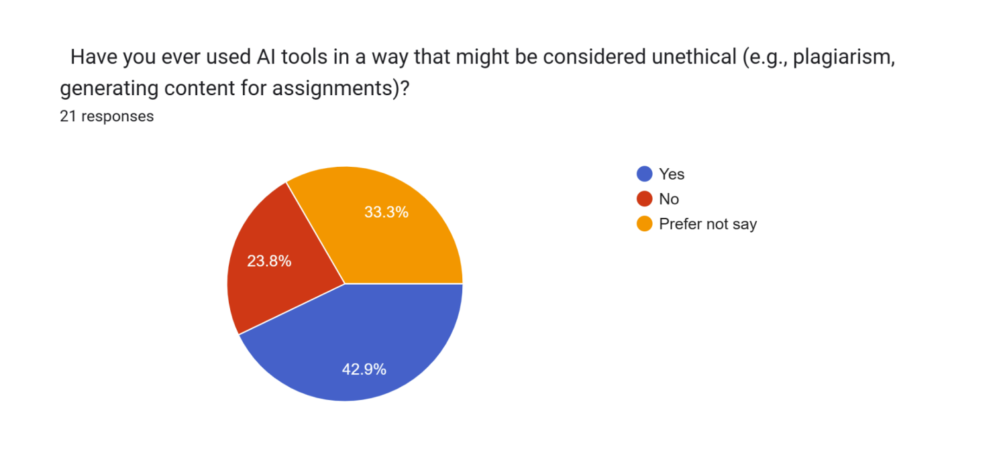

# **Impact of AI Learning Tools on Critical Thinking and Problem-Solving in Higher Education**

---

_Semester:_ **Fall 2024** 
_COURSE ID:_ **ENG07107**

_Acknowledgments:_

I would like to express my heartfelt thanks to all those who contributed to the completion of this research project:

- **Abdullah Kaleem**
- **[Muhammad Areeb Khan](https://www.linkedin.com/in/muhammad-areeb-khan-98841a235/)**  
- **Ayman Shafique**
- **Maryam Shahid**

We would also like to express our sincere gratitude to **Ms. Mishal Mushtaq** for her continuous guidance and support throughout the course. Her constructive feedback and encouragement were invaluable in refining our work.

_**DEPARTMENT OF SOFTWARE ENGINEERING**_ 
_**THE UNIVERSITY OF LAHORE**_

---

## **Table of Contents**

[**Abstract**](#abstract) 
[**Introduction**](#introduction)
- [Context](#context)
- [Problem Statement](#problem-statement)
- [Objectives](#objectives)
- [Research Questions](#research-questions)
- [Hypothesis](#hypothesis)

[**Methodology**](#methodology)
- [Literature Review](#literature-review)
- [Survey](#survey)

[**Findings & Analysis**](#findings--analysis)
- [Survey Findings and Analysis](#survey-findings-and-analysis)
- [Discussion and Recommendations](#discussion-and-recommendations)

[**Conclusion**](#conclusion) 
[**References**](#references)

---

## **Abstract**

This research investigates the influence of AI learning tools on the development of critical thinking and problem-solving skills in higher education. A survey of students across a wide range of academic disciplines explores the frequency, types, and purposes of AI tool usage, along with their perceived effects on intellectual engagement, independence, and academic performance. Results show that while AI tools considerably enhance efficiency and problem-solving abilities, their overuse may compromise critical thinking and independent reasoning. Ethical issues related to misuse for plagiarism also underscore the need for institutional guidelines. The study further identifies variations in the impact of AI tools depending on students' academic disciplines and levels of technological proficiency. Recommendations range from promoting balanced use of AI, incorporating digital literacy programs, and setting up ethical guidelines. Only then can higher education institutions truly use AI tools as supportive aids that will augment, not undermine, the development of critical intellectual skills.

##  **Introduction**

### ***Context***

The integration of AI in higher education is changing patterns of teaching and learning through personalized platforms, virtual tutors, and adaptive technologies. Through these tools, short-term results in academics see an increase of interest, retention, and efficacy, but these tools' influences on long-term critical thinking or problem-solving remain far from certain. Critical thinking involves deep analysis of information, questioning assumptions, and synthesizing viewpoints, while problem-solving addresses problems methodically.

AI tools promise customized and responsive learning but raise questions whether overdependence might prevent independent thought and creative reasoning, eventually transforming students into passive information recipients. This research asks whether tools supported by AI enable cognitive engagement and skill-building or compromise crucial intellectual growth. Its results will therefore give insight into how to use AI in support of higher education to balance AI reliance with critical intellectual development that may guide future use.

Though AI-based learning tools can be proved effective in the improvement of short-term academic performance- knowledge retention, engagement, and even the time devoted to assignment completions-the long-term impact on cognitive development is a contentious issue. In particular, the question is arising as to whether these tools help to develop the skills of critical thinking and problem-solving that are considered to be very important for the successful completion of both academic and professional tasks. Critical thinking refers to the ability to think deeply and analytically about information, to question assumptions, and to synthesize multiple viewpoints. Problem-solving is the identification and resolution of challenges through a methodical approach.

### **Problem Statement**

The growing reliance on AI learning tools in higher education raises concerns about their impact on critical thinking and problem-solving skills. While these tools enhance efficiency and academic performance, their overuse risks diminishing intellectual independence and ethical academic practices, creating a critical need to balance technology with cognitive skill development.

### **Objectives**

The main goal of this paper is to find the impact that AI-based learning tools have on developing critical thinking and problem-solving skills in the context of students attending higher education institutions. Specifically, this paper tries to:

1. Assesses how the combination of frequency and type of use of AI tools contributes to cognitive engagement and intellectual independence.  
2. Examine the degree to which AI tools either help or hinder the capacity for critical thinking, integration, and creative problem-solving both in scholarly and practical contexts.  
3. Explore how the effect of AI tools could vary by subject matter among academics and between students who possess differing levels of background knowledge or experience.  
4. Share perspectives on how institutions of higher learning might properly balance AI-based technology use with the development of human, basic intellectual abilities.  
5. Educators and policymakers must be informed about the ethical, practical, and developmental considerations in responsible integration of AI tools in academic contexts.

The research aims to contribute to the ongoing conversation about the role of AI in higher education by accomplishing these objectives.

### **Research Questions**

Answering these research questions gives us an essential way to understand the multiple dimensions through which AI tools could potentially have an effect on the cognitive and academic development of higher education students.  
These research questions are to investigate the positive, negative, and ethical concerns related to using AI tools in learning environments.

> 1. Does higher education student learning with AI tools enhance their abilities to think critically and solve problems?
> 2. In what ways and to what degree does the level of frequency that students use AI tools influence the cognitive engagement, intellectual independence of students?
> 3. Which kind of AI tool is used more frequently by students and affects students' academic performances and problem-solving abilities?  
> 4. In what ways does dependency on AI tools affect students' ability to think critically and autonomously?
> 5. What do students perceive in the use of AI tools as supports or obstacles for intellectual and creative growth?
> 6. In what ways does students' subject and previous knowledge influence the effect of using AI tools?
> 7. What are the ethical issues with AI tools in academic contexts? How do students cope with the challenges?

### **Hypothesis**

> _The introduction of artificial intelligence-based educational tools in higher education environments impacts the development of critical thinking and problem-solving skills significantly. However, the reliance on such tools could be limited in cognitive engagement, intellectual freedom, and creativity if it is not combined with active learning approaches. The impact varies according to the disciplines of academic fields, existing levels of skills, and how frequently they are used._

## **Methodology**

### ***Literature Review***

The literature review summarizes what is found in available research regarding the use of AI-driven tools in education. The areas discussed include the advantages, such as personalized learning, motivation, and student achievement; challenges like ethics, data biasness, and over-reliance on technology; and impacts on cognitive skills. It then identifies knowledge gaps, primarily the long-term impacts that AI tools have on critical thinking and problem-solving abilities.

Because of its potential to revolutionize conventional pedagogical practices and foster crucial abilities like critical thinking and collaborative work, the use of generative AI tools in higher education has drawn the attention of researchers and educators. The primary contributions, difficulties, and potential of generative AI tools in higher education are reviewed in this section.

One study examines the use of AI-based chatbots in after-class reviews, highlighting how personalized, real-time feedback can boost student motivation, self-efficacy, and academic performance. Another paper explores the broader implications of AI in education, noting its potential to reshape teaching and learning environments while addressing challenges such as institutional resistance and the need for adaptation. A SWOT analysis of AI-based tools (ABTs) in education reveals strengths like personalized learning and automation of repetitive tasks but also acknowledges risks related to data privacy, bias, and the need for new skills. Further research is called for to understand the long-term effects of AI on cognitive development and academic integrity.

Additionally, AI’s role in administrative functions, such as grading and student support, is explored, with AI systems improving efficiency and personalizing content. However, ethical concerns and potential biases in AI models are significant challenges that require careful consideration. Lastly, the potential implications of ChatGPT, an AI language model, on education are examined, noting its ability to provide personalized responses while raising concerns about academic integrity, biases, and the decline of higher-order cognitive skills. Collectively, these studies emphasize the transformative potential of AI in education while calling for continued research to address ethical, practical, and long-term challenges.

All the abstracts reviewed addresses the positive impacts of AI tools on student motivation, academic performance, and administrative efficiency but largely overlooks the long-term consequences of AI on cognitive abilities.

The integration of AI tools into education is transforming the way students learn and engage with course material. However, as the use of these tools becomes more widespread, it is essential to examine their long-term effects on students' cognitive skills. The  aim is to fill the gap in existing research by investigating how prolonged exposure to AI-based educational tools impacts the development of critical thinking and problem-solving abilities. By addressing this issue, the research will provide important insights into the future of AI in education and its implications for cognitive development in higher education settings.

### ***Survey***

A survey was conducted with university students to understand their experiences with AI-driven tools and how they perceive the impact of these tools on cognitive development, such as critical thinking and problem-solving skills. The survey covered students in all disciplines of studies and different levels of experience with AI-based tools.

The survey consisted of both open-ended and closed-ended questions, divided into the following sections. Demographics and Background (Current level of education, field of study, proficiency with technology), usage of AI in Academics (Frequency of AI tool usage, types of tools used, purpose for using AI tools), Effects on Cognitive Abilities (Impact on critical thinking, problem-solving, Influence of AI on study habits), Ethical Considerations (Uses of AI in unethical ways, university guidelines on ethical usage if AI).

## **Findings & Analysis**

### ***Survey Findings and Analysis***

**Department Representation:**  
The largest group of respondents (66.6%) are from the SE/CS/IT departments, followed by smaller yet significant contributions from Medical/Pharmacy (19%). This indicates a strong participation of technology-oriented students. A diverse range of academic disciplines also participated, suggesting that the research findings can reflect perspectives beyond just technical fields.

**Semester-wise Participation:**  
The majority of respondents are in their 3rd semester (66.6%), with additional representation from other semesters, providing a broad view across different stages of academic progression.

**Skill Levels**:  
A majority of respondents rated themselves as Intermediate (57.1%) in terms of technological proficiency, followed by Advanced (19%) and Beginner (23.8%). This distribution demonstrates a moderate to high familiarity with technology among respondents, aligning well with the focus on AI tools in academic activities.

**Frequency of Use**:  
Half of the respondents (57.1%) report using AI tools daily, while others use them weekly (23.8%) or occasionally (19%). This reflects that AI tools are becoming integral in academic routines for most students.

**Primary Purposes**:  
The survey highlights the following top use cases for AI tools:

* 52.4% of students use AI to brainstorm and initiate academic tasks, showcasing how AI stimulates creative and critical thinking.  
* 47.6% of students nearly half use AI tools to tackle assignments, indicating their reliance on AI for structured and step-by-step solutions.  
* 47.6% of students say that AI tools are pivotal in aiding students with gathering information and conducting preliminary research.

**Challenges to Critical Thinking and Problem-Solving**

* The heavy reliance on AI tools like ChatGPT for idea generation and problem-solving might hint at reduced opportunities for independent critical thinking.  
* While AI tools enhance efficiency and broaden access to knowledge, the ability to evaluate, interpret, and synthesize information without AI could be compromised.  
* However, students proficient in technology (advanced users) might use these tools as helpers rather than replacements, reducing this concern.

**Academic Performance:**

Over half of the respondents (52.4%) strongly agree that using AI tools has significantly improved their ability to solve complex academic problems.

A considerable number of participants (38%) feel that AI tools provide moderate support in solving problems.

Only a small fraction of respondents (9.5%) expressed low confidence in the ability of AI tools to improve their problem-solving.

**Critical Thinking Skills:**

A majority of respondents (61.9%) believe that using AI tools has improved their critical thinking skills. About 19% of respondents feel that AI tools have not contributed to improving their critical thinking skills. An equal percentage (19%) of respondents are unsure about the impact of AI tools on their critical thinking abilities.

"No" and "Not Sure" responses (combined 38%) suggest that some students feel a disconnect between their use of AI and their critical thinking development.

**Independent Thinking:**

Over 61% of respondents (both 1 and 2\) acknowledge that their reliance on AI tools has affected their ability to think independently. 28.6% ( 3 ) feel a moderate impact on their independent thinking and a minority of 9.6% ( both 4 and 5 ) believe that AI tools have not significantly impacted their ability to think independently.

These findings suggest a growing need for programs that:

* Emphasize the balance between leveraging AI and fostering independent thinking.  
* Include activities that enhance self-reliance in solving academic and professional challenges.

**Influence on Study Habits:**

Nearly half (47.6%) of the respondents report that AI tools have made their study habits more efficient. ⅓ of respondents admit that AI tools have negatively affected their motivation to study independently. A remaining smaller group feels that AI has not significantly impacted their study habits.

**Ethical use in Academics:**

A significant portion of respondents (42.9%) admit to using AI tools in ways that might be considered unethical, highlighting a concerning trend where students may misuse AI. A smaller number (23.8%) states that they have not engaged in unethical use, suggesting an awareness of ethical standards. Whereas almost ⅓ opted not to disclose their stance, which might indicate hesitation to admit unethical behavior.

The high percentage of "Yes" indicates a need to address how AI tools are integrated into academic environments. This includes:

* Educating students about the long-term harms of unethical practices, such as decline in critical thinking skills.  
* Shifting the narrative around AI from being a shortcut to being a supportive tool that enhances learning.

**Establishing Guidelines**

The majority of respondents (52.4%) strongly support the establishment of clear university guidelines for ethical AI usage in academics. A small percentage oppose this idea, possibly viewing such regulations as unnecessary or restrictive to innovation and flexibility in learning.

The data from this survey leads us to answer the questions that we arose earlier in the introduction section.

> **Does higher education student learning with AI tools enhance their abilities to think critically and solve problems?**

Most of the survey results pointed out that AI tools very strongly improve the problem-solving abilities of students. More than half of the respondents (52.4%) strongly agree that AI tools have improved their ability to solve complex academic problems, while 38% report moderate improvements. However, although 61.9% believe AI tools improve critical thinking skills, 38% either doubt or remain unsure about this impact, which indicates a rather nuanced influence on critical thinking.

> **In what ways and to what degree does the level of frequency that students use AI tools influence the cognitive engagement, intellectual independence of students?**

Students who use AI tools more frequently (daily-57.1%) reported a high level of integration of these tools into their academic routine. However, 61% do admit that such reliance affects their ability to think and reason independently, to different extents. The findings suggest that frequent users may gain efficiency in getting tasks done but can also become less intellectually independent unless complemented with practices of active learning.

> **Which kind of AI tool is used more frequently by students and affects students' academic performances and problem-solving abilities?**

The most commonly used AI tools include writing assistants (such as ChatGPT) used by 52.4% of the students for brainstorming, and research aids used by 47.6% for solving assignments and conducting research. These tools afford structured support in improving academic performance but may detract from students' opportunities to practice independent problem-solving and creativity.

> **In what ways does dependency on AI tools affect students' ability to think critically and autonomously?**

Excessive dependence on AI tools for idea generation and problem-solving can be said to reduce the opportunities for independent critical thinking. The survey shows that although AI tools nurture efficiency, they may compromise the ability of a person to evaluate, interpret, and synthesize information independently. Advanced users, however, may use these tools as enablers rather than replacements, which may mitigate the negative effects.

> **What do students perceive in the use of AI tools as supports or obstacles for intellectual and creative growth?**

The majority of students believe AI tools are supportive to increasing efficiency and helping with their academic tasks; 47.6% claim to study more efficiently. However, about a third confess that AI diverts their motivation from studying independently. Both these perceptions clearly need balancing in view of a more holistic intellectual development.

> **In what ways does students' subject and previous knowledge influence the effect of using AI tools?**

Students from technology-oriented disciplines report more effective use of AI tools (66.6%), as do those with intermediate or advanced technological proficiency (76.1%). This might be an indication that the nature of academic discipline and familiarity with technology play an important role in the manner in which AI tools are used and their impact on critical thinking and problem-solving.

> **What are the ethical issues with AI tools in academic contexts? How do students cope with the challenges?**

Ethical concerns include misuse of AI tools for plagiarism or generating assignment content, with 42.9% of respondents admitting to such practices. A smaller group (23.8%) adheres to ethical standards. To address these issues, students advocate for clear university guidelines (52.4%), highlighting a collective desire for structured policies to promote ethical AI use and mitigate misuse.

### ***Discussion and Recommendations***

The findings of this study highlight the dual impact of AI tools on critical thinking and problem-solving skills in higher education. On one hand, AI tools significantly enhance students' efficiency, aiding in brainstorming, problem-solving, and research. A majority of respondents acknowledge improved academic performance and cognitive abilities, particularly in solving complex problems. However, the reliance on these tools raises concerns about the erosion of intellectual independence and critical thinking, as over 61% of students report some level of negative impact on their ability to think autonomously.

The AI paradox suggests that while AI tools provide invaluable support in academic tasks, unregulated and excessive use may hinder the development of essential cognitive skills. More technologically advanced students seem to be using AI tools in a much more strategic way, which shows the importance of digital literacy in using these technologies effectively while minimizing the disadvantages. Finally, ethical issues, such as misuse of AI in assignments, further increase the imperative for institutional policies and guidelines.

The influence of academic discipline and prior knowledge is also notable, with technology-oriented students reporting a more effective and balanced integration of AI tools into their studies. These findings underscore the varied impacts of AI tools, shaped by students' backgrounds and usage patterns.

Following are some of the recommendations that should be considered.

_**Promote Balanced AI Usage**_

Universities should encourage students to use AI tools as supplementary aids, not replacements for cognitive effort. Activities that mix AI usage with independent problem-solving and critical analysis must be incorporated into the curriculum.

_**Develop Digital Literacy Programs**_

Institutions should implement programs to enhance students' understanding of how to effectively and ethically use AI tools. The programs should target both beginner and intermediate users in order to bridge the skill gaps.

_**Incorporate Active Learning Strategies**_

Teachers should design assignments and activities that require students to engage deeply with the material, minimizing opportunities for passive information consumption through AI.

## **Conclusion**

The integration of AI learning tools into higher education has reshaped how students engage with academic challenges, offering both opportunities and risks. This study shows that while AI tools increase efficiency and improve problem-solving skills, they also challenge critical thinking and intellectual independence when overused. Students with advanced technological literacy tend to use AI tools as enablers, showing these technologies' potential to augment, not replace, cognitive effort. However, ethical issues such as misuse and overdependence call for structured guidelines and educational reforms.

Universities will have to adopt strategies that will ensure balanced usage, foster digital literacy, and emphasize ethical practices in using the benefits of AI tools while mitigating their negative impacts. By striking this balance, higher education can leverage AI to improve learning outcomes while preserving and nurturing important human intellectual skills.

## **References**

1. *Lee, Yen-Fen, Gwo-Jen Hwang, and Pei-Ying Chen. "Impacts of an AI-based chabot on college students’ after-class review, academic performance, self-efficacy, learning attitude, and motivation." Educational technology research and development 70.5 (2022): 1843-1865.*

2. *Popenici, Stefan AD, and Sharon Kerr. "Exploring the impact of artificial intelligence on teaching and learning in higher education." Research and practice in technology enhanced learning 12.1 (2017): 22\.*

3. *Denecke, K.; Glauser, R.; Reichenpfader, D. “Assessing the Potential and Risks of AI-Based Tools in Higher Education: Results from an eSurvey and SWOT Analysis.” Trends High. Educ. 2023, 2, 667–688.*

4. *L. Chen, P. Chen and Z. Lin, "Artificial Intelligence in Education: A Review," in IEEE Access, vol. 8, pp. 75264-75278, 2020\.*

5. *Farrokhnia, M., Banihashem, S. K., Noroozi, O., & Wals, A. (2023). A SWOT analysis of ChatGPT: Implications for educational practice and research. Innovations in Education and Teaching International, 61(3), 460–474.*
